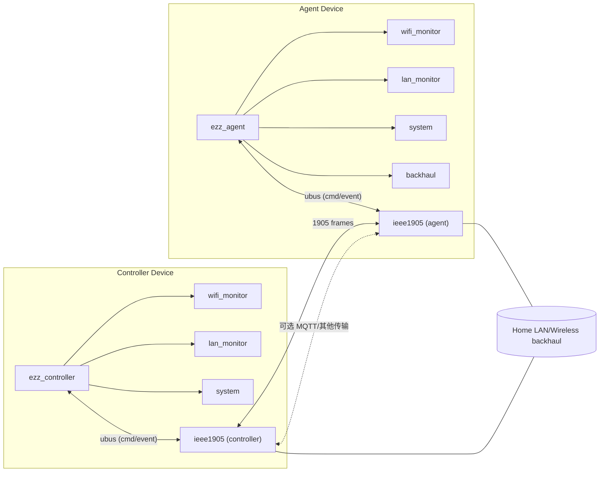

# ezz_mesh 设计稿

## 1.设计目标
- 拆分通信层：把 IEEE 1905.1 数据收发抽象为独立进程 `ieee1905`，仅负责收发 1905 报文及基础会话管理。
- 控制/业务逻辑：`ezz_controller`、`ezz_agent` 通过 ubus 与 `ieee1905` 交互，不直接处理 1905 报文。
- 演进预留：后续可替换或并行增加 MQTT 作为控制面传输，不改变控制/业务模块接口。

## 2. 进程介绍
- `ieee1905`：无论设备是 Controller 还是 Agent，都负责 1905 报文的收发、事件转发；不包含 Mesh 业务逻辑。
- `ezz_controller`：运行于 Controller 角色设备，负责控制面决策和配置下发。
- `ezz_agent`：运行于 Agent 角色设备，负责本地状态采集与上报、执行控制命令。
- 运行选择：Controller 设备启动 `ezz_controller` + `ieee1905`；Agent 设备启动 `ezz_agent` + `ieee1905`。

## 3. 模块划分
### 通信进程 `ieee1905`
- 职责：接收/解析/发送 1905 报文；维持链路状态；事件转发。
- 对上接口：ubus（命令 -> 发包；事件 <- 收包）。
- 对下接口：以太网/无线回程口，1905 框架。

### 控制进程 `ezz_controller`
- `wifi_monitor`：收集 Wi-Fi Client 列表、RSSI/速率、探针/数据包监控。
- `lan_monitor`：监控有线端口状态、MAC/流量统计。
- `system`：接收/设置配置（如其他系统配置），统一存储与下发。

### Agent 进程 `ezz_agent`
- `wifi_monitor`：同上，侧重本地实时采集与上报。
- `lan_monitor`：同上，侧重端口状态与流量。
- `system`：接收控制面配置并落地；本地配置变更上报。
- `backhaul`：监控回程链路（信号、速率、异常），向控制面上报/告警。

## 4. 结构框图

## 5. 数据流（概述）
- 控制面下发：`ezz_controller` 通过 ubus 调用 `ieee1905.tx_frame`（或抽象命令） -> `ieee1905` 组帧并发送 1905 控制帧。
- 控制面上报：`ieee1905` 收到 1905 帧 -> 解析事件 -> ubus 发布 `frame_ind` 给 `ezz_controller` 或 `ezz_agent`。
- 本地状态上报：Agent 的 `wifi_monitor`/`lan_monitor`/`backhaul` -> 上报给 `ezz_agent` -> 通过 ubus 请求 `ieee1905` 发送上报帧或通过本地 RPC 上送 Controller（后续可切换 MQTT）。
- 配置下发：Controller 的 `system`/`policy` -> ubus 调用 `ieee1905` 发送配置帧 -> Agent 侧 `ezz_agent` 处理后调用 `system` 落地。
- 启动流程：设备角色判定 -> 启动 `ieee1905` -> 启动对应进程（`ezz_controller` 或 `ezz_agent`）-> 注册 ubus 对象/订阅事件。

## 6. UBUS 接口草案（精简为收/发两类）
### `ieee1905` 暴露
- `send`（调用）：统一发包接口。参数示例 `{ "type": "topology_discover", "payload": {...必须字段...} }`。  
  - `type` 覆盖所有 1905 报文：如 `topology_discover`、`topology_notification`、`ap_search`、配置/能力/测量相关报文等。  
  - 必须字段随类型而定（如目的 MAC、测量参数）；非必须字段可省略，`ieee1905` 自行补齐可推导信息（如本机 MAC/ifname）。
- `recv`（事件）：统一收包事件。负载示例 `{ "type": "topology_discover", "src": "...", "payload": {...提取的必要字段...} }`，由 `ieee1905` 解析并抽取必要信息后推送给 `ezz_controller` 或 `ezz_agent`。

### `ezz_controller` 暴露
- `send`（调用）：向 `ieee1905` 请求发 1905 报文或后续 MQTT 报文，参数同上层抽象命令。
- `recv`（事件）：接收来自 `ieee1905` 的解析结果及必要字段，作为控制决策输入。
- 其他内部模块（wifi/lan/system/policy）与 `ezz_controller` 进程内通信，不再单独暴露 ubus 接口。

### `ezz_agent` 暴露
- `send`（调用）：向 `ieee1905` 请求发 1905 报文或后续 MQTT 报文，参数同上层抽象命令。
- `recv`（事件）：接收来自 `ieee1905` 的解析结果及必要字段，作为上报/执行输入。
- 本地 `wifi_monitor` / `lan_monitor` / `backhaul` / `system` 仍可通过进程内调用向 `ezz_agent` 投递事件或配置，不额外暴露 ubus。

## 7. 关键模块职责
- `wifi_monitor`：扫描/关联信息、RSSI/速率曲线、探针/数据包计数；必要时抓取摘要包做故障分析。
- `lan_monitor`：PHY/链路状态、MAC 学习表、端口流量统计。
- `system`：配置存储、回读、原子落地；向 `ieee1905` 注册本机能力。
- `backhaul`（Agent）：回程链路质量监控、异常告警、链路切换建议。
- `ieee1905`：最小化业务逻辑，仅做收发/事件转发；为后续 MQTT 并行传输保留接口一致性。

## 8. 运行与部署
- Controller 设备：启动 `ieee1905` -> `ezz_controller`，均注册到 ubus，总线名称可用 `ieee1905`, `ezz.ctrl`。
- Agent 设备：启动 `ieee1905` -> `ezz_agent`，总线名称可用 `ieee1905`, `ezz.agent`。
- 回程接口选择由 `system` 配置模块维护，并通知 `ieee1905` 使用指定端口。

## 9. 后续扩展（MQTT 预留）
- 方案：在 `ieee1905` 侧添加 MQTT 适配器，将 ubus 事件/命令映射到 MQTT 主题，保持控制/业务进程接口不变。
- 主题示例：`mesh/{role}/{device-id}/cmd`，`mesh/{role}/{device-id}/event`。
- 可配置切换：通过 `system` 模块切换传输后端（1905 / MQTT / 双发）。
