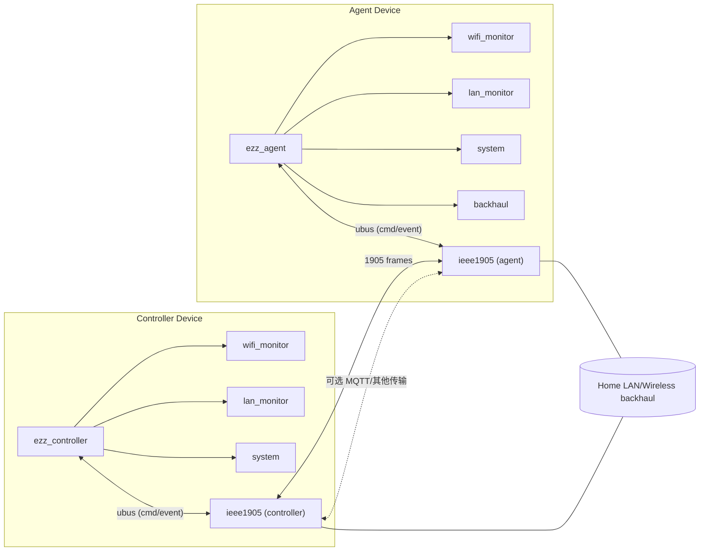

# ezz_mesh 设计稿（强调 ieee1905 独立进程 + ubus 交互）

## 1. 设计原则
- 通信面解耦：IEEE 1905.1 报文由独立进程 `ieee1905` 负责收发/解析/转发，不混入控制或业务逻辑。
- 控制/业务隔离：`ezz_controller`、`ezz_agent` 不直接操作 1905 报文，全部通过 ubus 与 `ieee1905` 交互（命令 -> 发包，事件 <- 收包）。
- 传输可替换：保持上层 ubus 接口不变，可平滑切换/并行 MQTT 等控制面传输。

## 2. 进程角色
- `ieee1905`（独立进程）：统一 1905 CMDU 组包/解包，管理链路状态，向上转发事件，向下收发以太网/回程口帧。
- `ezz_controller`：仅做控制决策与配置下发，通过 ubus 调用 `ieee1905.send`，订阅 `ieee1905.recv`。
- `ezz_agent`：仅做本地状态采集/上报与配置执行，通过 ubus 调用 `ieee1905.send`，订阅 `ieee1905.recv`。
- 运行方式：Controller 设备启动 `ieee1905` + `ezz_controller`；Agent 设备启动 `ieee1905` + `ezz_agent`。

## 3. 模块职责
### `ieee1905`（通信进程）
- 接收/解析/发送 1905 报文；维持链路状态。
- 对上：ubus（cmd/evt），未来可镜像到 MQTT 适配器。
- 对下：以太网/无线回程接口，1905 框架。

### `ezz_controller`
- 模块：`wifi_monitor`、`lan_monitor`、`system` 等；仅消费/产生 ubus 事件/命令。
- 不直接接触 CMDU/TLV。

### `ezz_agent`
- 模块：`wifi_monitor`、`lan_monitor`、`backhaul`、`system` 等；同样只通过 ubus 与 `ieee1905` 交互。

## 4. 结构框图


## 5. 数据流
- 下发：`ezz_controller` 调用 ubus `ieee1905.send` -> `ieee1905` 组 CMDU 并发帧。
- 上报：`ieee1905` 收到帧 -> 解析 -> ubus 事件 `ieee1905.recv` -> `ezz_controller` / `ezz_agent`。
- Agent 本地状态：Agent 内部模块 -> `ezz_agent` -> ubus 调用 `ieee1905.send` 上送；未来可直接转 MQTT，接口不变。
- 启动：判定角色 -> 启动 `ieee1905` -> 启动 `ezz_controller`/`ezz_agent` -> 注册/订阅 ubus。

## 6. ubus 接口草案
### `ieee1905` 暴露
- `send`（method）：统一发包，参数 `{ "type": "...", "payload": {...} }` 覆盖所有 1905 报文。
- `recv`（event）：统一收包事件 `{ "type": "...", "src": "...", "payload": {...} }`。

### `ezz_controller` / `ezz_agent` 暴露
- `send`（method，可选）：转发到 `ieee1905.send` 或 MQTT。
- `recv`（event）：订阅 `ieee1905.recv`，驱动控制/上报逻辑。

## 7. 当前代码脚手架说明（三进程 + ubus）
- 位置：
  - `include/ieee1905.h` / `src/ieee1905/`: 仅被独立进程 `ieee1905d` 使用。
  - `src/apps/ieee1905d.c`: 通信进程示例，注册 ubus 对象 `ieee1905`，提供 method `send`，收到 1905 帧后通过 event `ieee1905.recv` 广播。
  - `src/apps/ezz_controller.c` / `src/apps/ezz_agent.c`: 仅通过 ubus 调用/订阅 `ieee1905`，不直接调用 1905 库。
- 传输占位：
  - 底层帧：`ieee1905d` 使用 UDP 数据端口（默认 19050）代替真实 L2，后续可换 raw/packet socket。
  - 控制/事件：真实使用 ubus method/event（`ieee1905.send` / `ieee1905.recv`）。
- 目的：符合 OpenWrt 习惯的进程划分与 ubus 交互，后续替换底层传输或并行 MQTT 均保持接口不变。

## 8. 构建
```sh
make
```
产物位于 `build/bin/`：
- `ieee1905d`：通信进程示例（唯一链接 ieee1905 库）
- `ezz_agent`：Agent 示例（仅 IPC）
- `ezz_controller`：Controller 示例（仅 IPC）

## 9. 本机回环演示（三进程，ubus）
- 前提：OpenWrt 上 `ubusd` 已运行，`libubus/libubox` 可用。
- 场景：`ieee1905d` 独立进程暴露 ubus，`ezz_controller`/`ezz_agent` 通过 ubus 交互，底层帧仍用 UDP 数据口。
- 运行（三个终端）：
```sh
# 终端1：启动通信进程（独立进程）
./build/bin/ieee1905d

# 终端2：Agent 角色，占位模拟 ubus 上行
./build/bin/ezz_agent 19050   # data_port=19050

# 终端3：Controller 角色，占位模拟 ubus 下行
./build/bin/ezz_controller 127.0.0.1 19050
```
- 说明：
  - 控制命令：controller/agent 调用 `ieee1905.send`（ubus method）。
  - 事件：`ieee1905d` 通过 `ieee1905.recv`（ubus event）广播收包解析结果。
  - 底层：当前仍是 UDP 数据口；落地需换 L2/raw，并可添加 MQTT 并行适配。

## 10. 后续演进
- 接入 ubus：将示例中的直接调用替换为 ubus method/event，保持接口名一致。
- 底层传输：将 UDP 占位替换为 1905 以太网封装（raw/packet socket 或 D-Bus/内核接口）。
- MQTT 并行：在 `ieee1905` 进程侧增加 MQTT 适配器，映射同样的 send/recv 接口。
